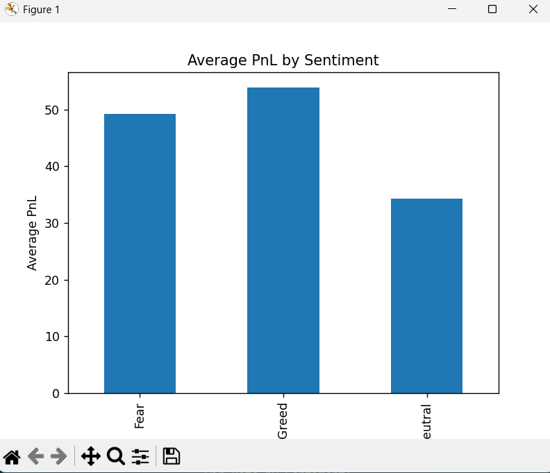
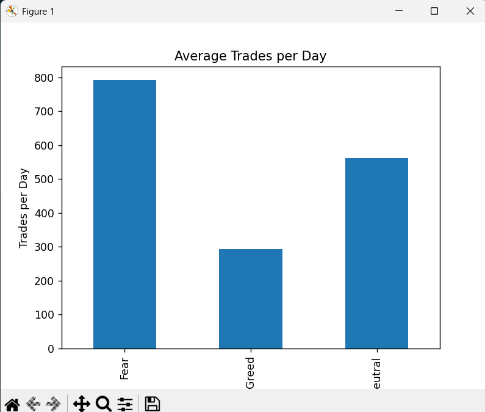
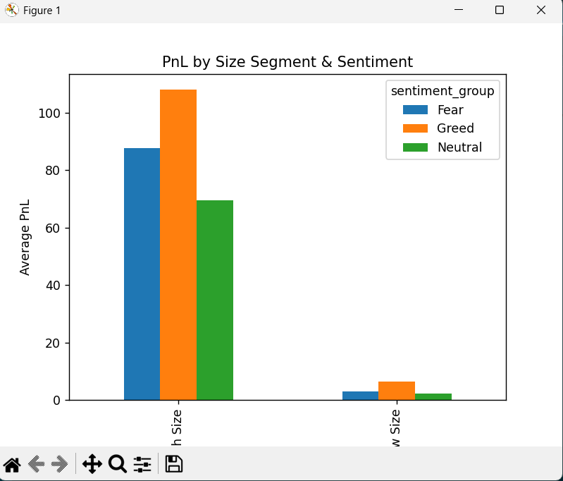

# 📊 Trader Sentiment vs Performance Analysis

## 🔎 Project Overview

This project analyzes trader performance under different market sentiment conditions  
(**Fear, Greed, Neutral**) using:

- 📈 Fear & Greed Index (Daily Sentiment Data)  
- 📊 Historical Trade-Level Data  

The objective is to evaluate how market sentiment influences:

- Profitability (PnL)  
- Win Rate  
- Trading Behavior  
- Trade Frequency  
- Position Size  
- Risk Characteristics  

**Total Trades Analyzed:** 211,218

---

## 🗂 Repository Structure

```
trader-sentiment-analysis/
│
├── data/
│   ├── fear_greed_index_1.csv
│   └── historical_data_2.csv
│
├── charts/
│   ├── avg_pnl_by_sentiment.png
│   ├── trades_per_day.png
│   └── size_segment.png
│
├── analysis.py
├── requirements.txt
├── summary.md
└── README.md
```

---

# 🧹 Part A — Data Preparation

- Loaded and inspected both datasets
- Checked missing values and duplicates
- Converted timestamps to datetime
- Aligned datasets on daily level
- Merged trade data with sentiment

### Key Metrics Created:

- Daily PnL
- Win Rate
- Long/Short Ratio
- Trades per Day
- Trader Segmentation (Frequent vs Infrequent)
- Position Size Segmentation (High vs Low Size)

---

# 📊 Part B — Analysis Findings

## 1️⃣ Performance by Sentiment

| Sentiment | Avg PnL | Win Rate |
|-----------|---------|----------|
| Fear      | 49.21   | 40.7%    |
| Greed     | 53.88   | 42.0%    |
| Neutral   | 34.30   | 39.7%    |

**Insight:**  
Greed days show the highest average profitability.  
Neutral days show the weakest performance.

---

## 2️⃣ Trading Behavior Changes

- Trade frequency highest during Fear
- Lowest activity during Greed
- Long/Short ratio relatively stable
- PnL volatility significantly higher in Fear & Greed

---

## 3️⃣ Segment Insights

### Frequent vs Infrequent Traders

- Infrequent traders generate higher PnL during Greed
- Frequent traders show more consistent but lower returns

### Position Size Segments

- High size traders outperform significantly
- Low size traders generate minimal returns

---

# 📊 Key Visual Insights

### Average PnL by Sentiment


### Average Trades Per Day


### PnL by Size Segment


---

# 💡 Part C — Strategy Recommendations

### Strategy 1 — Sentiment-Based Positioning
- Increase exposure during Greed
- Reduce exposure during Neutral
- Avoid overtrading during Fear spikes

### Strategy 2 — Segment-Based Optimization
- Scale selectively during Greed for infrequent traders
- Control leverage and trade size during volatile periods

---

# ⚙ How to Run

Install dependencies:

```
pip install -r requirements.txt
```

Run analysis:

```
python analysis.py
```

---

# 📌 Conclusion

Market sentiment significantly impacts:

- Profitability  
- Trading intensity  
- Risk profile  

Greed conditions show higher opportunity but also elevated volatility.  
Fear conditions increase activity without proportional profitability.

---

# 👤 Author

Nilesh Thakare  
Trader Sentiment Analysis Assignment